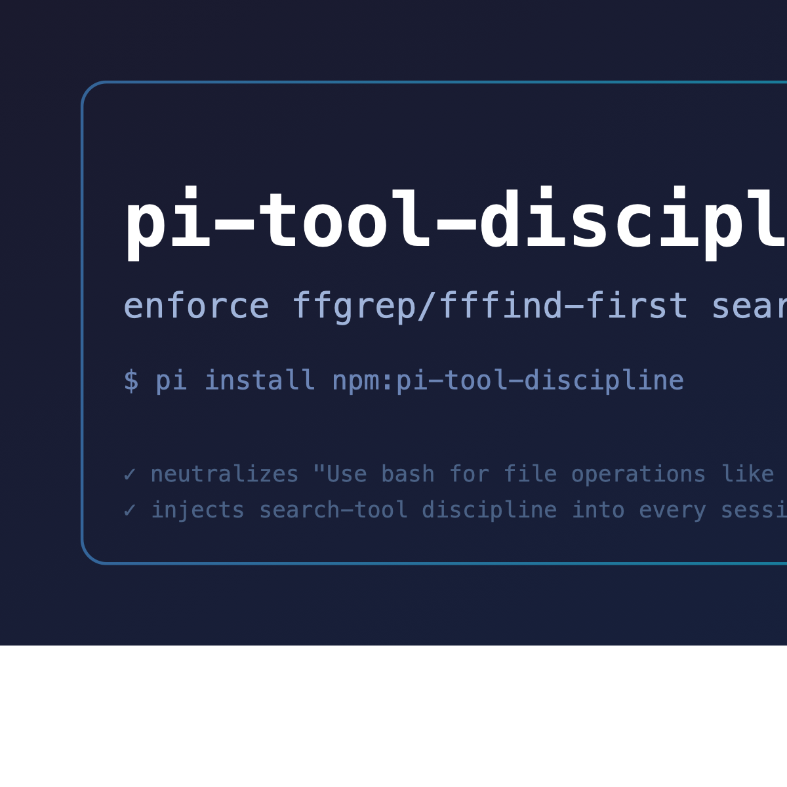

# pi-tool-discipline

<p align="center">
  
</p>

pi extension that enforces a **search-tools-first discipline** and removes the
conflicting "use bash for file operations" guidance pi injects by default.

## Why

Pi's system-prompt builder only injects
`Use bash for file operations like ls, rg, find` when **no tool named
`grep` / `find` / `ls` is active** ([dist/core/system-prompt.js]). FFF-style
search tools are named `ffgrep` / `fffind`, so pi mistakes them for "no search
tool available" and tells the model to use bash for everything — directly
fighting project instructions (like an `AGENTS.md` that says "use the grep
tool, not bash").

## How it works

Two mechanisms, applied automatically in every session:

1. **Placeholder tools (root fix).** Registers placeholder tools named
   `grep`, `find`, and `ls` (skipped if already registered). They carry no
   prompt snippet, so they never appear in the model's tool list and are never
   callable in practice. Their mere presence flips pi's `hasGrep`/`hasFind`/
   `hasLs` check, so the conflicting bash guideline is **never generated**.
2. **System-prompt injection (fallback + rules).** On every agent start,
   appends an idempotent "Tool Discipline" section to the system prompt:
   content search with `ffgrep`, path search with `fffind`, file reads with
   `read` (offset/limit), no bash `grep`/`rg`/`find`/`ls`/`cat`/`sed`/`head`/
   `tail`/`which` for searching, bash reserved for pipelines/git/npm/network.
   Also strips the default bash guideline text in environments where the
   placeholder registration is disabled.

## Install

```bash
pi install npm:pi-tool-discipline
# or try without installing:
pi -e npm:pi-tool-discipline
```

Requires `@ff-labs/pi-fff` (or any other extension providing `ffgrep`/`fffind`)
for the discipline to point at real search tools.

## Verify

Run `/tool-discipline` in a pi session — it reports whether the placeholder
tools are registered and whether the discipline section is injected.

You can also inspect the system prompt: the string
`Use bash for file operations like ls, rg, find` should no longer appear, and
`## Tool Discipline (pi-tool-discipline)` should be present.

## Security

This extension runs with full system access like any pi extension. It only
registers inert placeholder tools and appends text to the system prompt; it
does not execute commands, read files, or touch network. Review the source in
`extensions/index.ts` before installing.

## License

MIT
